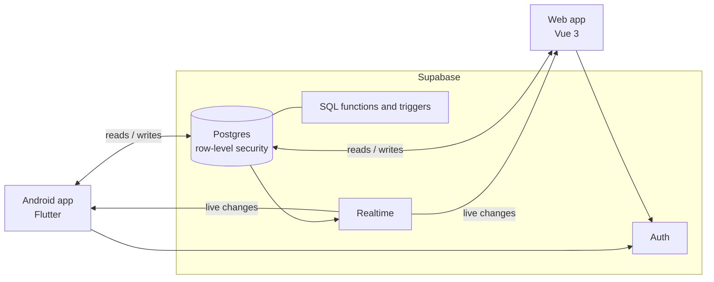

# Ventrafin

Ventrafin is a home finance tracker built with an Android app and a web app that stay in sync.

## Features

- **Transactions**: expenses, income and transfers across cash, bank and credit card accounts.
- **Fast batch entry**: a number keypad on the phone; a spreadsheet-style grid on the web that accepts rows pasted from Excel.
- **Auto-categorization**: a description such as "Restaurant dinner" is filed under Food, and every correction is learned for next time.
- **Reports**: this month against last month, per category, plus 6- and 12-month trends.
- **Bills and EMIs**: due dates, overdue status and marking bills paid, with reminders on the phone.
- **Also**: colour themes, CSV import and export, an app lock on the phone and Windows Hello sign-in on the web.

## Architecture

The Flutter app and the Vue app share one Supabase backend, with no server of their own. Row-level security limits every row to the signed-in user who owns it, and Supabase Realtime pushes changes made in one app to the other within seconds. Logic both apps need, such as auto-categorization and report totals, runs once in Postgres as SQL functions and triggers.

## Tech stack

| Part | Technology |
|---|---|
| Android app | Dart, Flutter, Riverpod |
| Web app | TypeScript, Vue 3, Vite, PrimeVue, Tailwind CSS |
| Backend | Supabase: Postgres, Auth, Realtime |
| Tests | Flutter tests, Vitest, pgTAP |
| Hosting | Vercel (web) |
