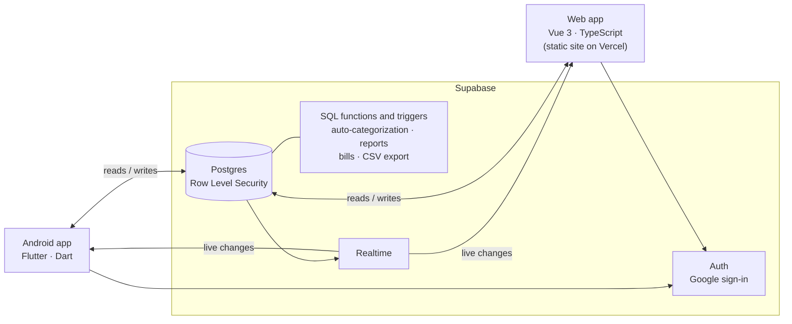

# Ventrafin

Ventrafin is a home finance tracker built for one person: a parent (called "Dad" throughout the docs) who is not technical but is comfortable in Excel. He logs the day's spending in one sitting in the evening, sometimes on his Android phone and sometimes on a Windows PC, and wants a private, detailed picture of where the money goes.

It is a real app in daily use, not a template. That shaped most of it: the data must stay private, entry must be quick and forgiving, and the screens are dense and table-first rather than simplified.

## What it does

- **Transactions**: expenses, income and transfers between Cash, Bank and Credit Card accounts. Money is stored as integer paise, never as a float.
- **Fast batch entry**: a number-keypad-first form with "Save & add another" on the phone; a spreadsheet-style grid on the web that accepts rows pasted straight from Excel.
- **Auto-categorization**: descriptions like `UPI/SWIGGY/4471023@icici` are sorted into categories from a built-in list of Indian merchants and billers. Every correction teaches a rule, so the same description is categorized correctly next time, on both apps.
- **Reports**: this month against last month, overall and per category, and 6- or 12-month trends, as charts with the same numbers in a table beside them.
- **Bills and EMIs**: due dates, overdue status, "mark paid" (optionally logging the payment), and reminders on the phone.
- **Six colour themes**, CSV export and import, a fingerprint or pattern lock on the phone, and Windows Hello sign-in on the web.

Budgets are deliberately left out: the user asked to track spending without limits.

## Architecture

Two independent apps share one Supabase backend. There is no custom server and no local database: every read and write goes straight to Supabase, and changes made on one app appear on the other within seconds through Supabase Realtime.



- **Privacy is enforced in the database.** Row Level Security is on for every table, and each row is visible and editable only by the signed-in user who owns it. The apps hold only the public (publishable) key; there is no admin view inside either app.
- **Shared logic lives in Postgres.** The two apps share no code, so anything that must behave the same on both is written once in SQL: auto-categorization and learning from corrections (triggers), category defaults, monthly totals and comparisons, bill schedules, and the CSV file both apps export.
- **Composite foreign keys** tie every row to its owner's accounts and categories, so one user's rows can never point at another user's.
- **The schema is versioned.** Every change is a migration in [`supabase/migrations`](supabase/migrations), checked by pgTAP tests in [`supabase/tests`](supabase/tests).

More detail: [`ARCHITECTURE.md`](ARCHITECTURE.md).

## Languages and frameworks

| Part | Built with |
|---|---|
| Android app (`mobile/`) | Dart, Flutter, Riverpod, go_router, fl_chart, local_auth (fingerprint), flutter_local_notifications |
| Web app (`web/`) | TypeScript, Vue 3, Vite, Vue Router, PrimeVue 4, Tailwind CSS 4; charts drawn as SVG by the app |
| Backend (`supabase/`) | SQL and PL/pgSQL on Supabase (Postgres, Auth, Realtime); pgTAP for database tests |
| Shared (`shared/`) | JSON design tokens (themes, category icons and colours) used by both apps |
| Tests | Flutter widget and unit tests; Vitest and Vue Test Utils; pgTAP |
| Hosting | Vercel for the web app; the Android app is installed directly |

## Key design decisions

The reasoning behind the design, including what was considered and rejected, is in [`DECISIONS.md`](DECISIONS.md). A few of the main ones:

- **Cloud only, no client-side encryption** (D1). The requirement is that nobody else can see the data inside the app, which Row Level Security covers, rather than protection from the backend operator.
- **Two separate apps instead of one Flutter codebase** (D2): the web side gets a spreadsheet-like grid that fits batch entry and pasting from Excel.
- **Supabase over Firebase** (D4): the data is relational, and SQL triggers and aggregates give both apps identical behaviour for free.
- **Dense, detailed screens** (D7) and **separate pages per section** (D8), because that is what the user asked for.
- **Letter badges instead of merchant logos** (D14): no third-party logo service ever sees what was bought.
- **Archive, never delete** accounts and categories that old entries still use (D29).

The product requirements are in [`PRD.md`](PRD.md).

## How it was built

Ventrafin was built incrementally with [Claude Code](https://claude.com/claude-code), following the phases in `PRD.md`: the Supabase foundation first, then the phone app, the web app, categorization, reports, bills and reminders, and finally themes, import and export, and Windows Hello. Each increment was a feature branch that left the app working, and a person reviewed and merged it. [`CLAUDE.md`](CLAUDE.md) is the working guide Claude Code followed: the ground rules, the database change process and the git workflow.

Once the app was in real use, the whole project was audited: both apps screen by screen, the database, security and code health. [`AUDIT.md`](AUDIT.md) lists every finding with an ID, a severity and a status. The findings were then fixed in rounds (first the most urgent and the PRD gaps, then every medium-severity item), each on its own branch, and the file records which commit fixed what. The remaining low-severity items are still listed as open.

Database changes follow the same care: each is a migration file with its tests, reviewed on its branch, then applied to the live project and verified against it.

## Repository layout

```
mobile/      Flutter app (Android)
web/         Vue 3 web app
supabase/    migrations, pgTAP tests, database notes
shared/      theme and category tokens used by both apps
scripts/     database test runner, backup credential helper
.github/     backup workflow (kept but switched off, see DECISIONS.md D28)
PRD.md · ARCHITECTURE.md · DECISIONS.md · AUDIT.md · CLAUDE.md
```
